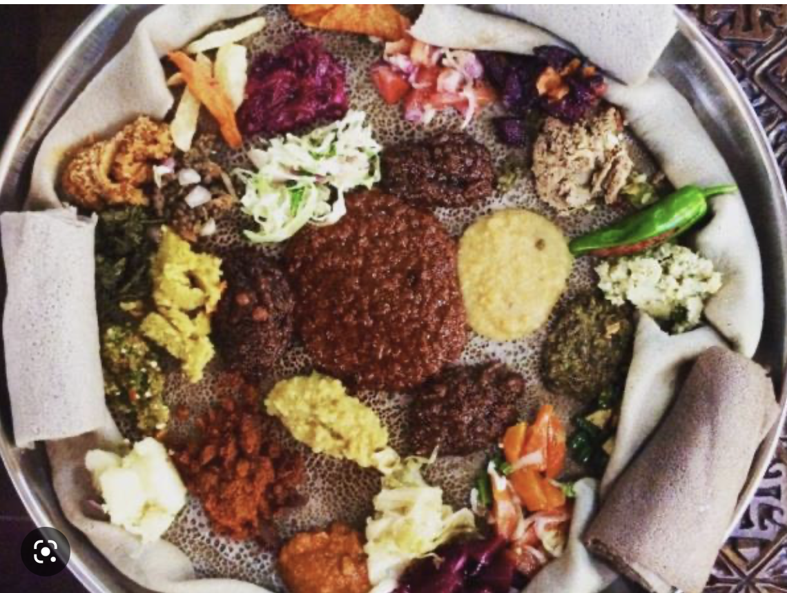

# All things Ethiopian 
My name is Tsedenia Biruk.My bio will be about my culture.

 
---
---
## ETHIOPIAN FOOD 
Popular Ethiopian dishes include injera, a spongy flatbread made with teff flour and often served with stews and salads, and wat, a spicy stew made with berbere spice, onions, garlic, and ginger. Other popular foods include tibs (meat or vegetables sautéed in oil, garlic, and spices) and shiro (a dish made with chickpeas, onions, and berbere). Vegetarians can enjoy shiro fit-fit (shiro with pieces of injera) and gomen (greens served with garlic, oil, and spices). Traditional Ethiopian drinks include tej (honey win)

---
---

## ETHIOPIAN DRESSES 
Ethiopian dress varies greatly among the many different ethnic groups in Ethiopia. Generally, men wear colorful, loose-fitting garments and women often wear white or brightly colored dresses with a shawl or scarf draped over the shoulders. Traditional Ethiopian clothing often includes headscarves, turbans, and brightly colored sashes. Jewelry is commonly worn, and is seen as a sign of beauty and prosperity.

---
---

## ETHIOPIAN HOLIDAYS 
Ethiopians celebrate many holidays throughout the year. The main holidays are Meskel, which marks the finding of the True Cross; Timkat, which celebrates the baptism of Jesus in the Jordan River; and Enkutatash, which marks the beginning of the Ethiopian new year on September 11. Other holidays include Genna, a traditional Christian holiday celebrated on January 7, and Meskal, a celebration of the Ethiopian Orthodox Church on September 26. 
Additionally, Ethiopians celebrate non-religious holidays, such as Victory Day on May 5 and the International Labor Day on May 1. They also observe special days such as the Day of Love, which is celebrated on the second Saturday of August, and the Day of Peace and Friendship on the first Saturday of October.

---
---

 
